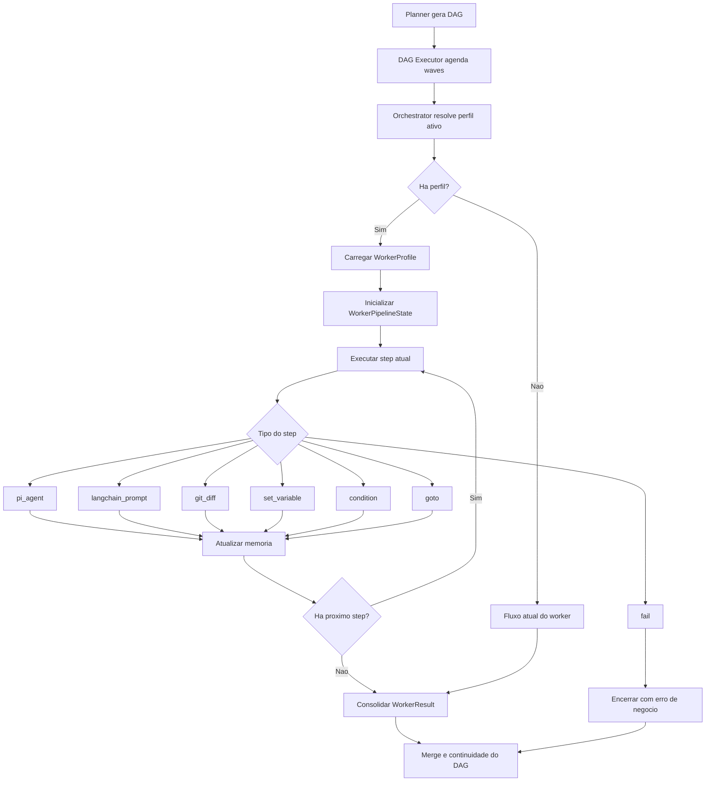
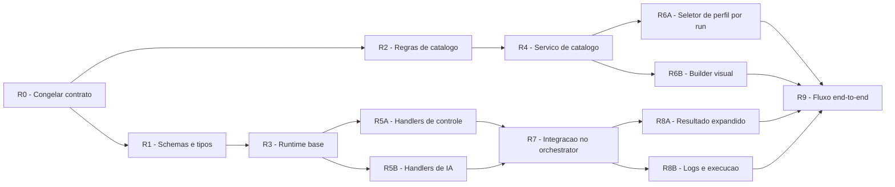

# Perfis de Worker com Pipeline Híbrida: visão, arquitetura e roadmap

## Sumário executivo

**Queremos evoluir o worker atual de um executor one-shot para um executor programável, reutilizável e observável, sem reescrever o scheduler do DAG.**

Hoje o produto planeja uma macro-task em DAG, agenda nós em waves e executa cada worker em um worktree isolado. Isso funciona bem para paralelismo e isolamento, mas força toda a lógica de execução do worker a caber em um único prompt e em uma única rodada principal. O resultado é baixo reuso, pouca capacidade de composição e pouca visibilidade sobre estratégias internas como gerar testes, validar, tentar corrigir, reformular prompt e falhar de forma explícita.

A proposta desta feature é introduzir **perfis de worker** selecionáveis por run. Cada perfil define uma **pipeline declarativa híbrida** com steps de Pi Agent e LangChainJS, memória compartilhada intra-worker, variáveis reservadas, condicionais e navegação por `goto`. O DAG atual continua sendo o scheduler de alto nível; a mudança acontece **dentro** da execução de cada worker.

O objetivo da V1 é entregar uma base pequena, fechada e previsível:

- um único perfil ativo por run, com opção de `nenhum perfil` para manter o comportamento atual;
- memória compartilhada apenas dentro do mesmo worker;
- builder visual para criar e editar perfis;
- persistência JSON em catálogos global e por projeto;
- steps V1 fechados: `pi_agent`, `langchain_prompt`, `condition`, `goto`, `set_variable`, `git_diff`, `fail`;
- sem step de sucesso explícito: **terminar sem `fail` significa sucesso**.

---

## 1. Contexto e problema

O fluxo atual do produto pode ser resumido assim:

1. O planner decompõe a macro-task em um DAG.
2. O DAG executor resolve dependências e agenda waves paralelas.
3. O orchestrator cria um `workerFn` para cada nó.
4. O worker runner executa um agente Pi com um prompt único e retorna um `WorkerResult`.

As peças mais importantes desse fluxo vivem em:

- [../../src/pipeline/planner.pipeline.ts](../../src/pipeline/planner.pipeline.ts)
- [../../src/pipeline/dag-executor.ts](../../src/pipeline/dag-executor.ts)
- [../../src/pipeline/orchestrator.ts](../../src/pipeline/orchestrator.ts)
- [../../src/agents/worker-runner.ts](../../src/agents/worker-runner.ts)
- [../../src/prompts/worker.prompt.ts](../../src/prompts/worker.prompt.ts)
- [../../src/schemas/worker-result.schema.ts](../../src/schemas/worker-result.schema.ts)

Esse desenho tem vantagens claras: isolamento por worktree, merge controlado, paralelismo por dependência e baixo acoplamento entre nós do DAG. O problema é que **a inteligência operacional do worker ainda é achatada em um único passo**.

Isso limita casos como:

- gerar testes antes de codar;
- validar o estado do worktree no meio da execução;
- decidir dinamicamente se o próximo passo é tentar de novo, reformular a task ou falhar;
- registrar variáveis de runtime que steps posteriores precisam ler;
- construir perfis reutilizáveis para estratégias de execução diferentes.

Em termos práticos, falta uma camada intermediária entre “o nó do DAG” e “a execução final do Pi Agent”.

---

## 2. O que queremos com a feature

Queremos transformar a execução do worker em um **micro-runtime declarativo**, mantendo o scheduler do DAG estável.

### Objetivos principais

- Permitir criar **perfis de worker reutilizáveis**.
- Permitir escolher **um perfil por run**, aplicável a todos os workers daquela execução.
- Permitir compor steps de execução e controle sem reescrever a lógica do DAG.
- Dar ao worker **memória compartilhada intra-worker** para que um step alimente o próximo.
- Permitir loops controlados e fluxos condicionais usando `condition` e `goto`.
- Melhorar observabilidade: logs por step, estado final, erro explícito e trilha de execução.
- Preservar o modo atual como fallback quando o usuário selecionar `nenhum perfil`.

### Não objetivos da V1

- Perfis diferentes para workers diferentes no mesmo run.
- Memória compartilhada entre nós diferentes do DAG.
- DAG dinâmico ou alteração do scheduler de waves.
- LangGraph como dependência obrigatória.
- Catálogo remoto de perfis.
- Step de sucesso explícito.

---

## 3. Decisões já fechadas

As seguintes decisões já estão fechadas para a V1:

| Tema | Decisão |
|---|---|
| Unidade de configuração | Perfis de worker reutilizáveis |
| Seleção em runtime | Um único perfil por run, ou `nenhum perfil` |
| Escopo da memória | Apenas intra-worker |
| Forma de autoria | Builder visual |
| Persistência | JSON em catálogo global e catálogo local por projeto |
| Steps V1 | `pi_agent`, `langchain_prompt`, `condition`, `goto`, `set_variable`, `git_diff`, `fail` |
| Variáveis reservadas | `task`, `diff`, `error` |
| Namespace customizado | `custom_*` |
| Semântica de sucesso | Terminar sem `fail` = sucesso |
| Semântica de `diff` | Diff do worker atual |
| Arquitetura macro | O DAG atual continua como scheduler |

Essas decisões são importantes porque reduzem ambiguidade e evitam que UI, schema e runtime evoluam em direções incompatíveis.

---

## 4. Experiência de produto desejada

Na V1, a experiência do usuário será organizada em dois momentos distintos.

### 4.1 Gestão de perfis

Na área de configuração inicial, o usuário poderá:

- criar um perfil novo;
- escolher se o perfil é global ou local ao projeto;
- montar visualmente a pipeline do worker;
- configurar prompts, destinos, variáveis e condições;
- salvar o perfil em JSON sem precisar escrever JSON manualmente.

### 4.2 Seleção do perfil do run

Na etapa final antes da execução da task, o usuário poderá:

- escolher `nenhum perfil`, preservando o modo atual;
- escolher um perfil local do projeto;
- escolher um perfil global do usuário.

### 4.3 Comportamento do builder

O builder visual precisará:

- listar todas as variáveis disponíveis em cada step;
- validar referências antes de salvar;
- quando uma variável não existir, sugerir a mais próxima por aproximação textual;
- se a sugestão não for suficiente, listar as variáveis válidas para seleção explícita.

---

## 5. Arquitetura atual relevante

Hoje a arquitetura pode ser vista em cinco camadas:

| Camada | Responsabilidade | Arquivos principais |
|---|---|---|
| Configuração | Carregar config, modelos e fluxo da app | [../../src/app.tsx](../../src/app.tsx), [../../src/hooks/use-config.ts](../../src/hooks/use-config.ts), [../../src/schemas/config.schema.ts](../../src/schemas/config.schema.ts) |
| Planejamento | Gerar DAG a partir da macro-task | [../../src/pipeline/planner.pipeline.ts](../../src/pipeline/planner.pipeline.ts) |
| Scheduling | Resolver dependências, waves e paralelismo | [../../src/pipeline/dag-executor.ts](../../src/pipeline/dag-executor.ts) |
| Orquestração | Criar `workerFn`, encaminhar progresso e consolidar resultado | [../../src/pipeline/orchestrator.ts](../../src/pipeline/orchestrator.ts) |
| Execução do worker | Rodar Pi Agent e produzir resultado | [../../src/agents/worker-runner.ts](../../src/agents/worker-runner.ts) |

O ponto central da proposta é **não mover a responsabilidade do scheduler**. O DAG executor continua resolvendo ordem, dependência e concorrência. A nova camada entra entre o orchestrator e o worker runner.

---

## 6. Arquitetura proposta

### 6.1 Ideia central

Cada nó do DAG continua sendo uma unidade de trabalho isolada em um worktree. A diferença é que, quando houver um perfil ativo, o worker deixa de executar um único passo e passa a executar um **runtime multi-step**.

### 6.2 Leitura em camadas

| Camada | Estado atual | Estado proposto |
|---|---|---|
| DAG executor | Agenda nós | Continua igual |
| Orchestrator | Resolve worker único | Resolve perfil opcional e chama runtime multi-step |
| Worker runner | Executa um Pi Agent | Continua como primitiva de step `pi_agent` |
| LangChain | Planejamento e explorer | Entra também como primitiva `langchain_prompt` |
| Runtime interno | Não existe | Interpreta steps, memória, condição e `goto` |

### 6.3 Diagrama de execução



### 6.4 Princípio arquitetural

**O DAG agenda macro-unidades. O runtime do worker executa micro-fluxos.**

Esse recorte mantém a mudança local, reduz risco de regressão e preserva o modelo mental atual do sistema.

---

## 7. Modelo de dados proposto

### 7.1 Catálogos de perfis

Teremos dois catálogos com o mesmo schema:

- global do usuário: `~/.pi-dag-cli/worker-profiles.json`
- local do projeto: `.pi-dag/worker-profiles.json`

### 7.2 Estrutura do catálogo

```json
{
  "version": 1,
  "profiles": [
    {
      "id": "test-driven-fixer",
      "description": "Gera testes, tenta corrigir, valida e reformula task se necessario.",
      "scope": "project",
      "workerModel": "anthropic/claude-sonnet-4.6",
      "langchainModel": "openai/gpt-5-mini",
      "entryStepId": "write-tests",
      "maxStepExecutions": 20,
      "seats": 1,
      "initialVariables": {
        "custom_tries": 0
      },
      "steps": []
    }
  ]
}
```

### 7.3 Tipos de step da V1

| Step | Função |
|---|---|
| `pi_agent` | Executa o agente Pi no worktree atual |
| `langchain_prompt` | Gera ou refina prompt/saída estruturada |
| `condition` | Avalia expressão e escolhe próximo passo |
| `goto` | Salta explicitamente para outro step |
| `set_variable` | Define ou atualiza variável |
| `git_diff` | Materializa o diff atual do worker |
| `fail` | Encerra o fluxo com erro explícito |

### 7.4 Exemplo de pipeline do caso de uso principal

```json
{
  "id": "test-driven-fixer",
  "description": "Gera testes, tenta corrigir, valida e reformula task se necessario.",
  "scope": "project",
  "workerModel": "anthropic/claude-sonnet-4.6",
  "langchainModel": "openai/gpt-5-mini",
  "entryStepId": "init-tries",
  "maxStepExecutions": 20,
  "seats": 1,
  "initialVariables": {
    "custom_tries": 0
  },
  "steps": [
    {
      "id": "init-tries",
      "type": "set_variable",
      "target": "custom_tries",
      "value": 0,
      "next": "write-tests"
    },
    {
      "id": "write-tests",
      "type": "pi_agent",
      "taskTemplate": "Use $task para escrever ou atualizar os testes necessarios para esta task.",
      "next": "implement-fix"
    },
    {
      "id": "implement-fix",
      "type": "pi_agent",
      "taskTemplate": "Use $task para implementar a correcao e fazer os testes passarem. Ao final escreva true ou false em $custom_pass.",
      "next": "collect-diff"
    },
    {
      "id": "collect-diff",
      "type": "git_diff",
      "target": "diff",
      "next": "check-pass"
    },
    {
      "id": "check-pass",
      "type": "condition",
      "expression": "$custom_pass == true",
      "whenTrue": "done",
      "whenFalse": "check-tries"
    },
    {
      "id": "check-tries",
      "type": "condition",
      "expression": "$custom_tries >= 1",
      "whenTrue": "fail-run",
      "whenFalse": "rebuild-task"
    },
    {
      "id": "rebuild-task",
      "type": "langchain_prompt",
      "inputTemplate": "A task original foi: $task\n\nO diff atual e: $diff\n\nReescreva a task para uma nova tentativa mais eficaz.",
      "outputTarget": "task",
      "next": "increment-tries"
    },
    {
      "id": "increment-tries",
      "type": "set_variable",
      "target": "custom_tries",
      "valueExpression": "$custom_tries + 1",
      "next": "implement-fix"
    },
    {
      "id": "fail-run",
      "type": "fail",
      "messageTemplate": "Nao foi possivel concluir a task apos replanejamento. Ultimo diff: $diff"
    },
    {
      "id": "done",
      "type": "goto",
      "target": "__end__"
    }
  ]
}
```

### 7.5 Estado de runtime

O runtime do worker precisa manter um estado explícito e serializável.

| Campo | Papel |
|---|---|
| `currentStepId` | Cursor atual da execução |
| `reservedVars` | `task`, `diff`, `error` |
| `customVars` | Variáveis do namespace `custom_*` |
| `stepResults` | Resultado bruto e resumido de cada step |
| `artifacts` | Saídas estruturadas que não são variáveis |
| `trace` | Histórico dos steps executados |
| `lastError` | Último erro técnico ou de negócio |
| `stepExecutionCount` | Contador total para proteção contra loop infinito |

### 7.6 Variáveis reservadas

| Variável | Origem | Atualização |
|---|---|---|
| `task` | Input principal do worker | Pode ser sobrescrita por `langchain_prompt` ou `set_variable` |
| `diff` | Step `git_diff` | Sempre reflete o diff do worker atual no momento da coleta |
| `error` | Runtime | Preenchida em falhas técnicas ou de negócio |

---

## 8. Semântica de runtime

### 8.1 Regra de sucesso e falha

- Se a pipeline terminar sem `fail`, o worker é considerado bem-sucedido.
- `fail` representa falha de negócio explícita.
- Erros técnicos do runtime também encerram o worker com falha.

### 8.2 Navegação

- `condition` avalia uma expressão simples e escolhe um destino.
- `goto` altera explicitamente o cursor de execução.
- `__end__` encerra a pipeline com sucesso.

### 8.3 Guardas de segurança

Como a V1 aceita `goto` livre, o runtime precisa aplicar proteções obrigatórias:

- limite máximo de execuções de step por worker;
- erro claro quando o limite for ultrapassado;
- trilha de execução para depuração;
- validação de destino inexistente ainda no momento de salvar o perfil.

### 8.4 Semântica dos steps de IA

#### `pi_agent`

- roda dentro do worktree do worker atual;
- recebe acesso às variáveis resolvidas no template;
- pode produzir arquivos, diff, logs e saídas que serão projetadas no estado do runtime.

#### `langchain_prompt`

- recebe input estruturado a partir das variáveis atuais;
- gera prompt refinado ou saída estruturada;
- normalmente escreve em `task` ou em algum `custom_*`.

---

## 9. Como a feature será feita

Vamos implementar a feature como **expansão incremental sobre a arquitetura atual**, e não como reescrita.

### 9.1 Estratégia de implementação

1. Congelar o contrato da feature.
2. Criar schemas e serviço de catálogo.
3. Criar o runtime multi-step do worker.
4. Implementar os handlers da V1.
5. Integrar com o orchestrator.
6. Expor seleção de perfil e builder visual na UI.
7. Expandir observabilidade e resultado.
8. Testar e validar o fluxo completo.

### 9.2 Componentes impactados

| Domínio | Arquivos mais impactados | Tipo de mudança |
|---|---|---|
| Configuração | [../../src/schemas/config.schema.ts](../../src/schemas/config.schema.ts), [../../src/hooks/use-config.ts](../../src/hooks/use-config.ts), [../../src/app.tsx](../../src/app.tsx) | Referência a perfil ativo e integração com catálogos |
| Orquestração | [../../src/pipeline/orchestrator.ts](../../src/pipeline/orchestrator.ts) | Resolver perfil do run e acionar runtime multi-step |
| Scheduling | [../../src/pipeline/dag-executor.ts](../../src/pipeline/dag-executor.ts) | Ajustes mínimos de compatibilidade com resultado expandido |
| Runtime do worker | [../../src/agents/worker-runner.ts](../../src/agents/worker-runner.ts) | Reuso como step `pi_agent` |
| Prompts | [../../src/prompts/worker.prompt.ts](../../src/prompts/worker.prompt.ts) | Separar melhor prompt base e payload do runtime |
| Resultado | [../../src/schemas/worker-result.schema.ts](../../src/schemas/worker-result.schema.ts) | Trazer trace, steps e falha terminal |
| UI | [../../src/screens/config-screen.tsx](../../src/screens/config-screen.tsx), [../../src/screens/task-screen.tsx](../../src/screens/task-screen.tsx), [../../src/screens/execution-screen.tsx](../../src/screens/execution-screen.tsx), [../../src/components/worker-log.tsx](../../src/components/worker-log.tsx), [../../src/components/status-bar.tsx](../../src/components/status-bar.tsx) | Builder, seleção de perfil e visibilidade de execução |
| Git | [../../src/git/git-wrapper.ts](../../src/git/git-wrapper.ts) | Base para step `git_diff` |

---

## 10. Roadmap da feature

Este roadmap segue quatro princípios:

- **contrato antes de UI**;
- **runtime antes de integração**;
- **catálogo pode evoluir em paralelo à UI**;
- **o scheduler do DAG fica fora do caminho crítico**.

### 10.1 Grafo de dependências



### 10.2 Workstreams e dependências

| ID | Workstream | Entregável | Depende de | Pode rodar em paralelo com |
|---|---|---|---|---|
| R0 | Contrato da feature | Invariantes, nomenclatura e semântica V1 | Nenhum | Nada; é bloqueante |
| R1 | Schemas do domínio | `WorkerProfile`, `WorkerStep`, `WorkerPipelineState` | R0 | R2 |
| R2 | Regras de catálogo | Paths, precedência, leitura/escrita e conflitos | R0 | R1 |
| R3 | Runtime base | Cursor, execução, trace e limites de step | R1 | R4 |
| R4 | Serviço de catálogo | Carregar catálogo global/local | R2 | R3 |
| R5A | Handlers de controle | `condition`, `goto`, `set_variable`, `fail`, `git_diff` | R3 | R5B |
| R5B | Handlers de IA | `pi_agent`, `langchain_prompt` | R3 | R5A |
| R6A | Seleção de perfil no run | UI para `nenhum perfil` ou perfil ativo | R4 | R6B |
| R6B | Builder visual | Criar/editar/salvar perfis | R1, R4 | R6A |
| R7 | Integração no orchestrator | Acoplamento do perfil ao worker | R3, R5A, R5B | R6A, R6B |
| R8A | Resultado expandido | Novo contrato de saída do worker | R7 | R8B |
| R8B | Observabilidade | Logs por step e execução visual | R7 | R8A |
| R9 | Testes e validação | Unitários, integração e fluxo manual | R6A, R6B, R8A, R8B | Documentação final |

### 10.3 Caminho crítico

O caminho crítico da entrega é:

`R0 -> R1 -> R3 -> R5A/R5B -> R7 -> R8A/R8B -> R9`

Esse é o caminho mínimo para que a feature exista de ponta a ponta.

### 10.4 Frentes paralelizáveis

As seguintes frentes podem avançar em paralelo após o congelamento do contrato:

- `R1` e `R2`;
- `R3` e `R4`;
- `R5A` e `R5B`;
- `R6A` e `R6B`;
- `R8A` e `R8B`.

### 10.5 Fases sugeridas

| Fase | Foco | Saída esperada |
|---|---|---|
| Fase 0 | Contrato | Documento de decisão fechado |
| Fase 1 | Domínio | Schemas e catálogos definidos |
| Fase 2 | Execução | Runtime base e handlers V1 |
| Fase 3 | Integração | Orchestrator usando perfis |
| Fase 4 | Produto | Seleção de perfil, builder e observabilidade |
| Fase 5 | Qualidade | Testes, validação manual e refinamentos |

---

## 11. Riscos e anti-padrões

### Riscos principais

| Risco | Descrição | Mitigação |
|---|---|---|
| Loop infinito | `goto` pode criar fluxo improdutivo | `maxStepExecutions`, trace e erro terminal claro |
| Drift entre builder e runtime | UI salva um formato que o runtime interpreta diferente | Schema único e validação compartilhada |
| Catálogo ambíguo | Perfis duplicados entre escopos | Identidade clara, origem explícita e regra de resolução documentada |
| Observabilidade insuficiente | Falha interna vira caixa-preta | Logs por step, trace e `failureReason` |
| Escopo de memória crescer cedo demais | Misturar memória intra-worker com cross-worker | Fixar V1 como intra-worker |
| Acoplamento indevido ao DAG | Tentar colocar steps dentro do DAG | Manter o DAG como scheduler de macro-unidades |

### Anti-padrões que precisamos evitar

- Fazer o builder visual inventar um formato próprio, diferente do schema persistido.
- Colocar regras de runtime escondidas apenas em prompt.
- Tentar resolver cross-worker memory na V1.
- Expandir a lista de step types antes de estabilizar a V1.
- Reescrever o DAG executor para acomodar uma feature que vive dentro do worker.

---

## 12. Critérios de aceitação

- O usuário consegue criar um perfil visualmente e salvá-lo em catálogo global ou local.
- O usuário consegue selecionar um perfil por run ou escolher `nenhum perfil`.
- Um run sem perfil continua se comportando como hoje.
- Um run com perfil executa a pipeline respeitando `condition` e `goto`.
- O runtime compartilha memória apenas dentro do worker atual.
- `diff` sempre representa o diff do worker atual quando o step `git_diff` roda.
- `fail` produz erro explícito e legível para a UI.
- Terminar sem `fail` resulta em sucesso do worker.
- A execução exibe step atual, histórico e motivo de falha quando houver.

---

## 13. Checklist de implementação

- [ ] Congelar schema de perfil, steps e runtime state.
- [ ] Definir catálogo global e local com regras de resolução claras.
- [ ] Criar runtime multi-step com cursor, trace e limite de execução.
- [ ] Implementar handlers V1.
- [ ] Integrar o perfil ativo ao orchestrator.
- [ ] Expandir `WorkerResult` para refletir steps e falha terminal.
- [ ] Adicionar seleção de perfil por run.
- [ ] Construir builder visual com validação de variáveis por aproximação.
- [ ] Expor logs e progresso por step na UI.
- [ ] Cobrir schema, runtime e fluxo end-to-end com testes.

---

## 14. Referências internas

### Código

- [../../src/app.tsx](../../src/app.tsx)
- [../../src/hooks/use-config.ts](../../src/hooks/use-config.ts)
- [../../src/schemas/config.schema.ts](../../src/schemas/config.schema.ts)
- [../../src/pipeline/planner.pipeline.ts](../../src/pipeline/planner.pipeline.ts)
- [../../src/pipeline/dag-executor.ts](../../src/pipeline/dag-executor.ts)
- [../../src/pipeline/orchestrator.ts](../../src/pipeline/orchestrator.ts)
- [../../src/agents/worker-runner.ts](../../src/agents/worker-runner.ts)
- [../../src/prompts/worker.prompt.ts](../../src/prompts/worker.prompt.ts)
- [../../src/schemas/worker-result.schema.ts](../../src/schemas/worker-result.schema.ts)
- [../../src/git/git-wrapper.ts](../../src/git/git-wrapper.ts)

### Documentos do projeto

- [context-building.md](./context-building.md)
- [story-breaking.md](./story-breaking.md)
- [file-agent-patterns.md](./file-agent-patterns.md)
- [prompt-engineering.md](./prompt-engineering.md)
- [prompts-guide.md](./prompts-guide.md)

---

## 15. Conclusão

Esta feature não muda a identidade central do produto. O DAG continua sendo a máquina de decomposição e scheduling. O que muda é a sofisticação do worker: ele deixa de ser um executor monolítico e passa a ser um executor de micro-fluxos declarativos.

Se implementada dessa forma, a V1 entrega um ganho grande de flexibilidade sem abrir uma frente grande de risco arquitetural. O valor está exatamente nesse recorte: **mais poder dentro do worker, quase nenhuma mudança no scheduler global**.
